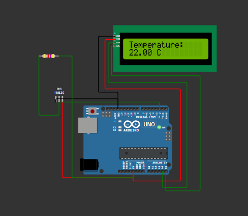
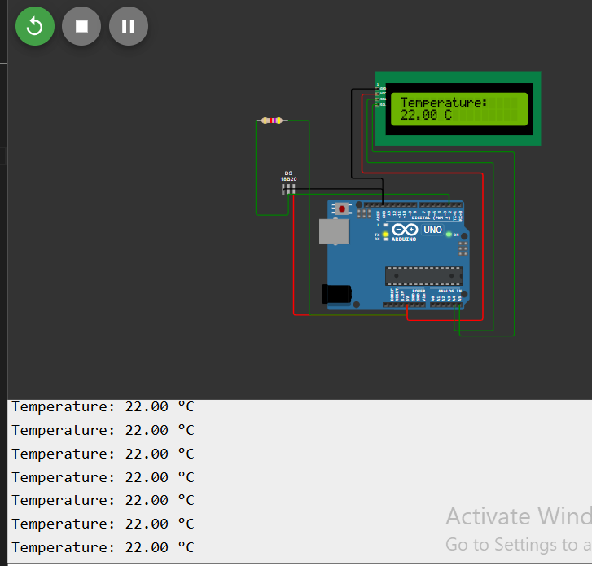
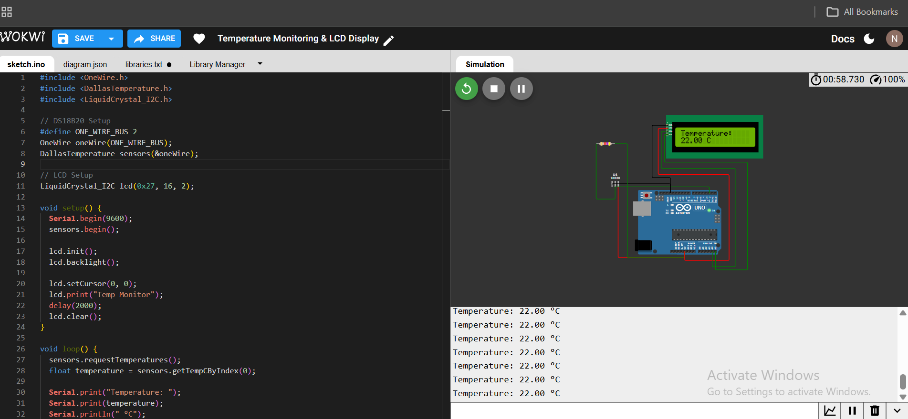

📌 Task-1: Temperature Monitoring with LCD Display
🧾 Project Overview

This project implements a real-time temperature monitoring system using an Arduino UNO, a DS18B20 digital temperature sensor, and a 16x2 I2C LCD display. The system reads temperature data using the OneWire communication protocol, displays the value on the LCD, and logs readings to the Serial Monitor for debugging and validation. The project is simulated and verified using Wokwi.

🎯 Objective

To design and simulate an embedded system that:

Reads temperature from a digital sensor

Displays live readings on an LCD

Logs data via Serial communication

🛠 Components Used

Arduino UNO

DS18B20 Temperature Sensor

16x2 LCD with I2C module

4.7kΩ Pull-up Resistor

Breadboard

Jumper wires

🔌 Wiring Diagram
🔹 DS18B20 Connections
DS18B20 Pin	Arduino UNO Connection
VCC	5V
GND	GND
DATA	Digital Pin 2
4.7kΩ Resistor	Between DATA and 5V

✔ The pull-up resistor ensures stable OneWire communication.

🔹 I2C LCD Connections
LCD Pin	Arduino UNO Connection
VCC	5V
GND	GND
SDA	A4
SCL	A5

✔ I2C communication reduces wiring by using only two signal lines (SDA and SCL).

⚙ Working Principle

The Arduino initializes Serial communication, the DS18B20 sensor, and the I2C LCD.

The DS18B20 measures temperature and sends digital data via the OneWire protocol.

The Arduino reads the temperature value.

The temperature is:

Displayed on the LCD screen

Printed to the Serial Monitor at 9600 baud rate

The system updates every 1 second in a continuous loop.

🔄 Output

Real-time temperature display on 16x2 LCD

Serial logging enabled

Temperature updates every second

Adjustable temperature in Wokwi simulation

🧠 Learning Outcomes

Digital sensor interfacing using OneWire protocol

I2C communication for LCD display

Serial debugging techniques

Embedded system simulation and validation

🔗 Simulation Link
https://wokwi.com/projects/457454429057026049
## 🖼 Circuit Diagram

## 📟 Output Screenshot

## Code and Circuit with Output 

